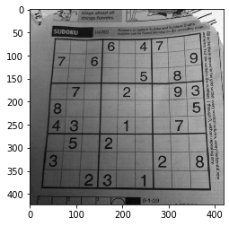
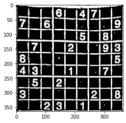
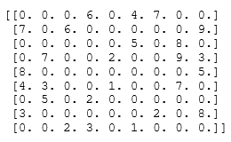
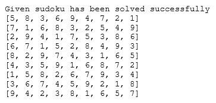

# Sudoku Solver (OpenCV)

## Introduction

The solver is capable of solving a sudoku directly from an image captured from any digital camera. After applying appropriate pre-processing to the acquired image we use efficient area calculation techniques to recognize the enclosing box of the puzzle. A virtual grid is then created to identify the digit positions. Once the digits are identifies, they are respresented in a form of matrix and then the sudoku is solved using backtracking algorithm.

Steps: 

- Extract the sudoku from the image.
- Extract each number present in the image.
- Compute the solution of the sudoku using algorithm.

## Implementation

### Initial Puzzle:

### Step 1

- Firstly we will need to process the image for finding the grid.
- Next we will find corners of the largest polygon this finding the outer square of the sudoku.
- Next step it to crop and warp the image so if the perspective isn’t right, we can change it in such a way that the image is taken right from the top of the grid.
- The last step is to infer the grid from the square images.

Result:

### Step 2

- Load pre-trained model so we can use it for number detection.
- Extract each cell of a number in sudoku puzzle.
- Compare it with pretrained model and return a int format number.
- Form a numpy array representing respective numbers in sudoku and 0 for representing empty cell.

Result:

### Step 3
- Convert numpy array into nested list.
- Check for the values 0 and send its respective location for backtracking
- Check if the number is valid or not in the cell if yes then return true
- It assign number from 1 to 9 and if a number is valid for that cell than replaces that number with valid digit.

Result:

